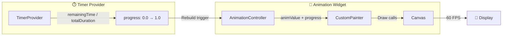
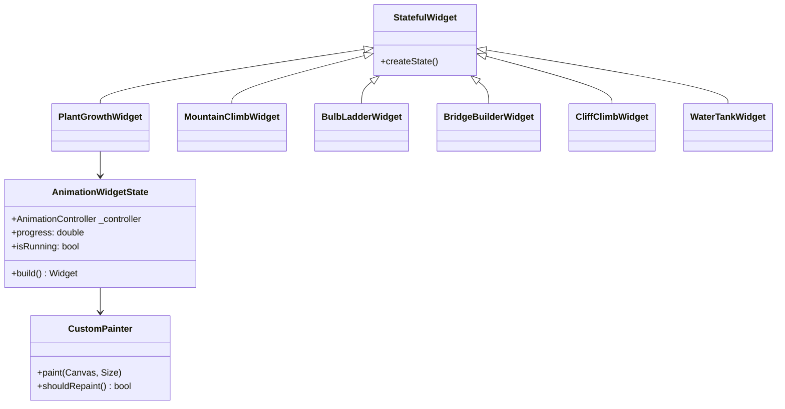
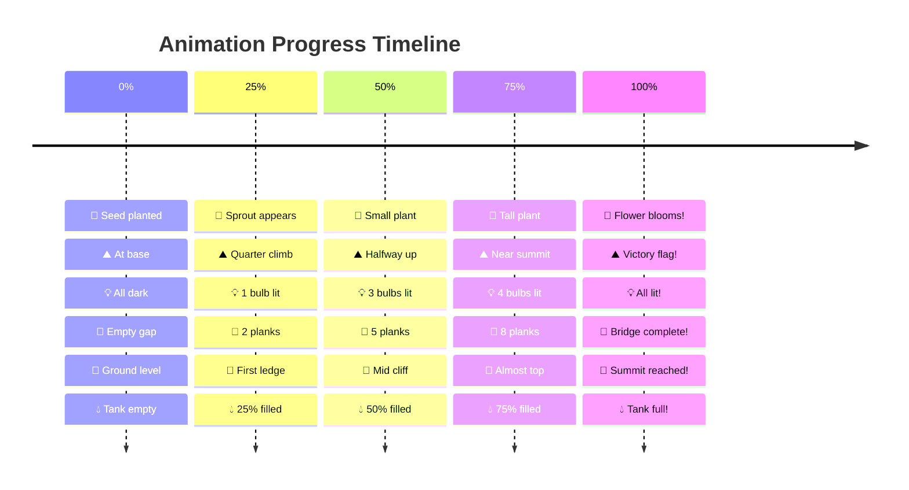
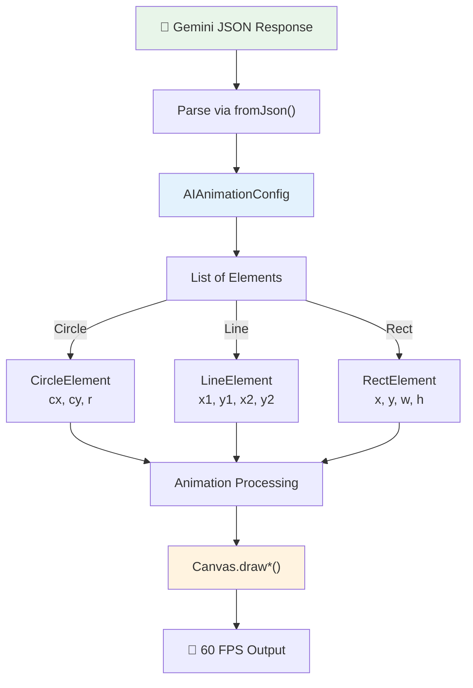
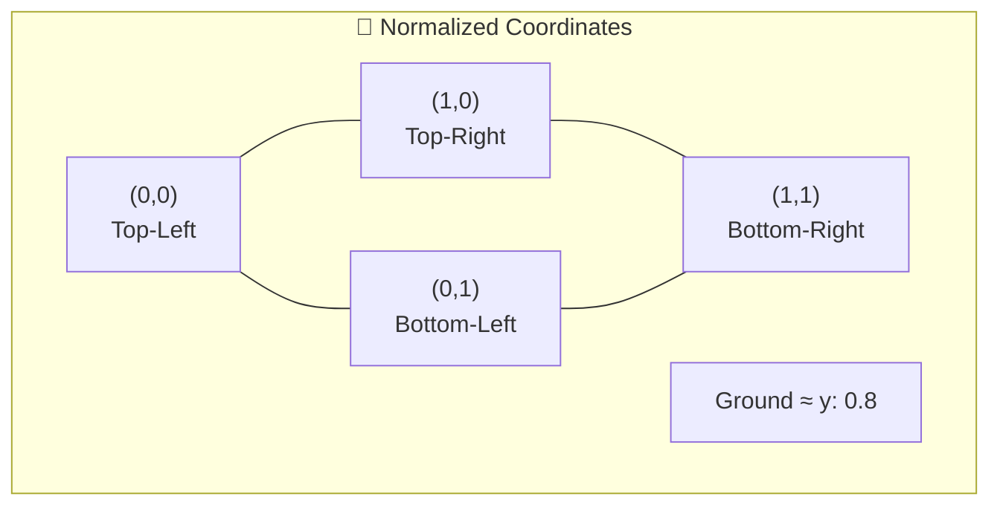
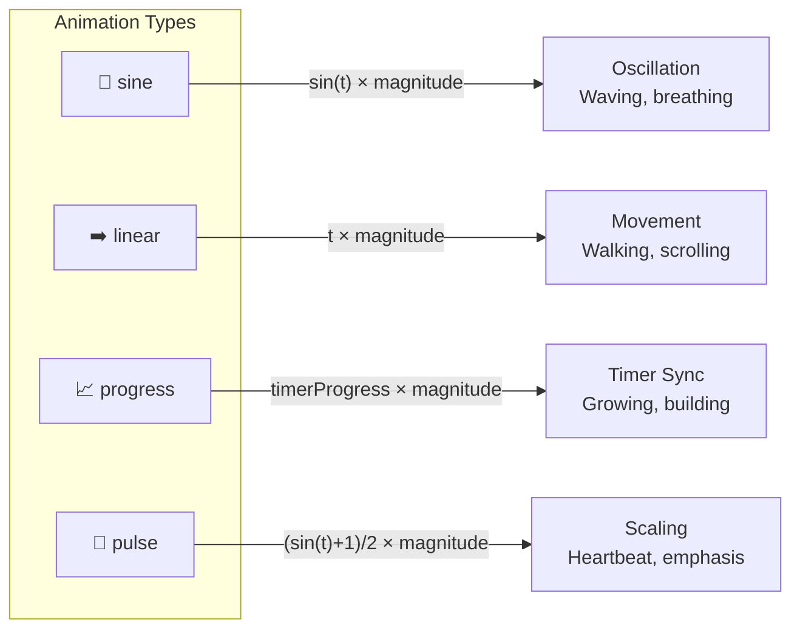
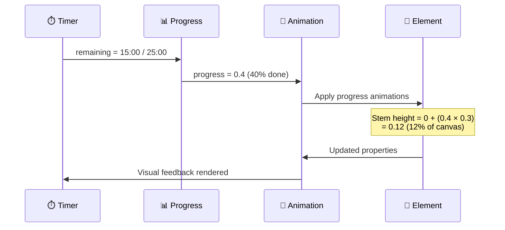
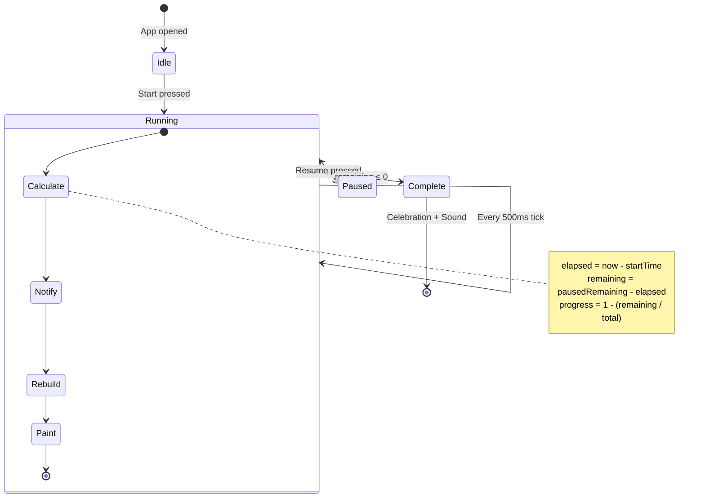
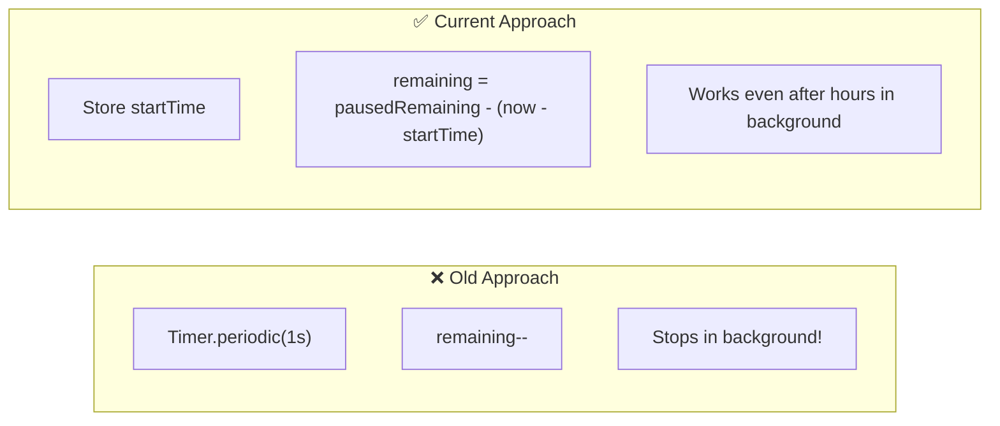
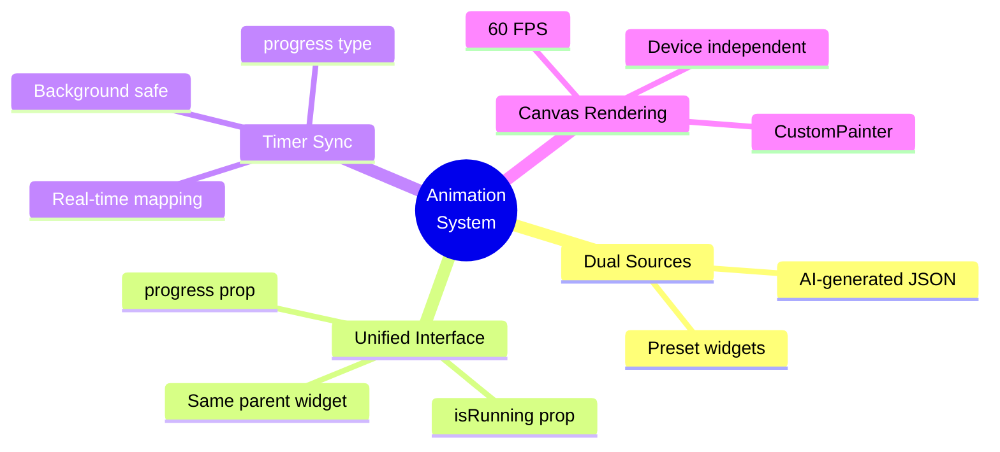

<div align="center">

# 🎨 Animation System

### *The Engine That Brings Focus to Life*

**From code to canvas: how we render timer-synchronized animations**

</div>

---

## 🌐 Overview

The animation system supports two types of visual companions:

| Type | Source | Customization |
|------|--------|---------------|
| **Preset** | Hand-coded CustomPainter widgets | 6 fixed animations |
| **AI-Generated** | Gemini JSON → dynamic renderer | Unlimited possibilities |

Both share a critical feature: **progress synchronization** with the focus timer.

---

## 🔄 The Render Loop



---

## 🎬 Preset Animations

### Widget Hierarchy



### The Six Companions



---

## 🤖 AI-Generated Animations

### Data Flow



### Element Types

| Type | Properties | Draw Method |
|------|------------|-------------|
| **Circle** | `cx`, `cy`, `r` | `canvas.drawCircle()` |
| **Line** | `x1`, `y1`, `x2`, `y2` | `canvas.drawLine()` |
| **Rect** | `x`, `y`, `w`, `h` | `canvas.drawRect()` |

### Coordinate System



All coordinates are **normalized (0.0 to 1.0)** for device independence.

---

## 🎭 Animation Types



### The Magic of `progress` Type

This is what makes animations **session-aware**:



---

## 🖌️ Rendering Pipeline

### Step-by-Step Canvas Drawing

```mermaid
flowchart TD
    START[paint() called] --> BG["Draw Background<br/>canvas.drawRect(bgColor)"]
    
    BG --> LOOP["For each element in config.elements"]
    
    LOOP --> CALC["Calculate animated values"]
    
    CALC --> TYPE{Element Type?}
    
    TYPE --> |Circle| CIRC["drawCircle(<br/>  Offset(cx, cy),<br/>  radius,<br/>  paint<br/>)"]
    
    TYPE --> |Line| LINE["drawLine(<br/>  Offset(x1, y1),<br/>  Offset(x2, y2),<br/>  paint<br/>)"]
    
    TYPE --> |Rect| RECT["drawRect(<br/>  Rect.fromLTWH(x, y, w, h),<br/>  paint<br/>)"]
    
    CIRC --> NEXT[Next element]
    LINE --> NEXT
    RECT --> NEXT
    
    NEXT --> |More elements| LOOP
    NEXT --> |Done| END[Frame complete]
```

### Animation Value Calculation

```dart
double _animate(element, property, baseValue) {
  for (anim in element.animations) {
    if (anim.property == property) {
      switch (anim.type) {
        case 'sine':
          return base + sin(animValue × 2π × speed) × magnitude;
        case 'linear':
          return base + (animValue × speed % 1) × magnitude;
        case 'progress':
          return base + timerProgress × magnitude;  // 🎯 KEY!
        case 'pulse':
          return base + ((sin(animValue × 2π × speed) + 1) / 2) × magnitude;
      }
    }
  }
  return baseValue;
}
```

---

## ⏱️ Timer Synchronization



### Background Persistence

The timer uses **DateTime-based calculation**, not tick counting:



---

## 📁 File Reference

| File | Responsibility |
|------|----------------|
| `animation_widgets.dart` | 5 preset animations (Mountain, Bulb, Bridge, Cliff, Water) |
| `plant_growth_widget.dart` | Plant growth animation (most complex) |
| `ai_animation_widget.dart` | AI animation renderer with CustomPainter |
| `ai_animation_config.dart` | JSON parsing and data models |
| `timer_provider.dart` | Progress calculation and background handling |

---

## 🎯 Key Insights



---

<div align="center">

**[← Gemini Integration](./GEMINI_INTEGRATION.md) • [Back to README →](./README.md)**

</div>
