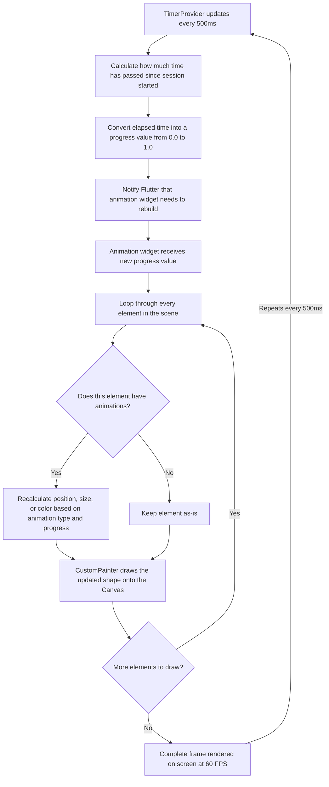
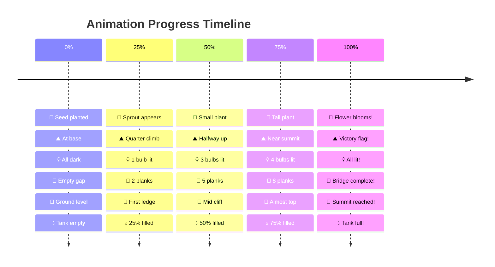
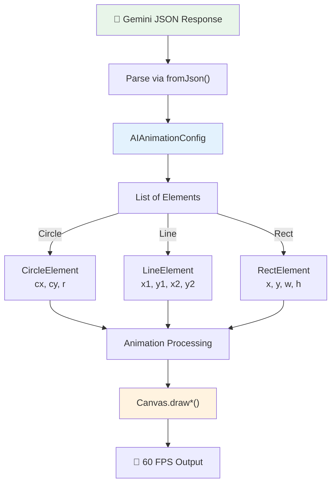
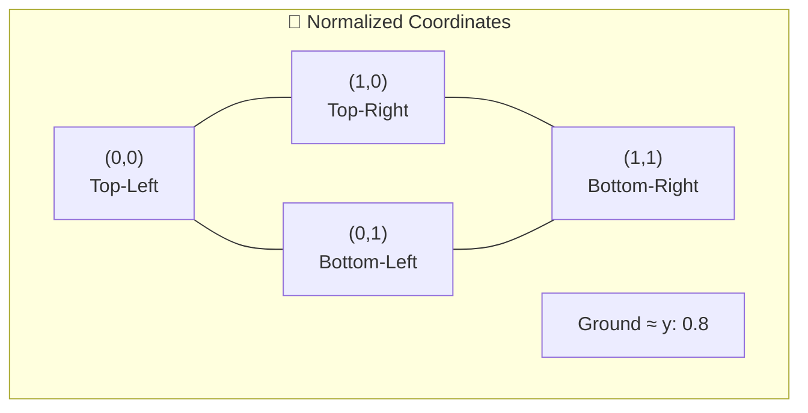
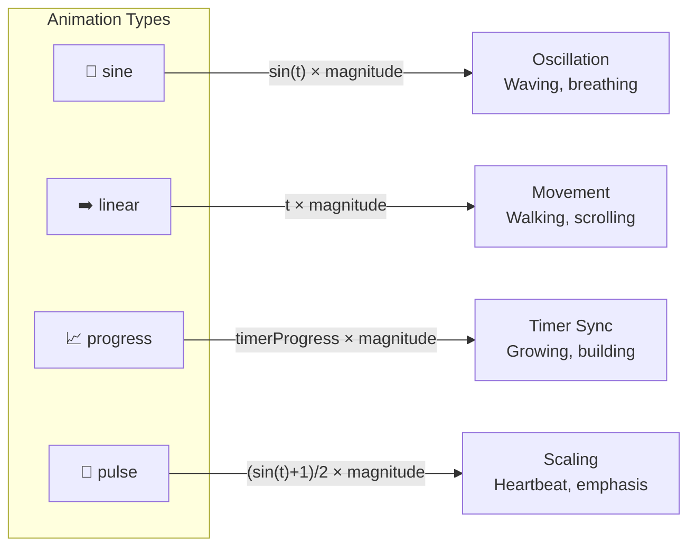

# 🎨 Animation System

### *The System that renders Gemini 3 output to animation.*

**From code to canvas: how we render timer-synchronized animations**

---

## 🌐 Overview

The animation system supports two types of visual companions:

| Type | Source | Customization |
|------|--------|---------------|
| **Preset** | Hand-coded CustomPainter widgets | 6 fixed animations |
| **AI-Generated** | Gemini JSON → dynamic renderer | Unlimited possibilities |

Both share a critical feature: **progress synchronization** with the focus timer.

---

## 🔄 The Render Loop

Every frame on screen follows this pipeline:

```mermaid
graph TD
    A[TimerProvider updates every 500ms] --> B[Calculate how much time has passed since session started]
    B --> C[Convert elapsed time into a progress value from 0.0 to 1.0]
    C --> D[Notify Flutter that animation widget needs to rebuild]
    D --> E[Animation widget receives new progress value]
    E --> F[Loop through every element in the scene]
    F --> G{Does this element have animations?}
    G -->|Yes| H[Recalculate position, size, or color based on animation type and progress]
    G -->|No| I[Keep element as-is]
    H --> J[CustomPainter draws the updated shape onto the Canvas]
    I --> J
    J --> K{More elements to draw?}
    K -->|Yes| F
    K -->|No| L[Complete frame rendered on screen at 60 FPS]
    L -->|Repeats every 500ms| A
```

## 🎬 Preset Animations

### There are six preset animations

```mermaid
timeline
    title Animation Progress Timeline
    
    0% : 🌱 Seed planted
       : ⛰️ At base
       : 💡 All dark
       : 🌉 Empty gap
       : 🧗 Ground level
       : 💧 Tank empty
    
    25% : 🌱 Sprout appears
        : ⛰️ Quarter climb
        : 💡 1 bulb lit
        : 🌉 2 planks
        : 🧗 First ledge
        : 💧 25% filled
    
    50% : 🌱 Small plant
        : ⛰️ Halfway up
        : 💡 3 bulbs lit
        : 🌉 5 planks
        : 🧗 Mid cliff
        : 💧 50% filled
    
    75% : 🌱 Tall plant
        : ⛰️ Near summit
        : 💡 4 bulbs lit
        : 🌉 8 planks
        : 🧗 Almost top
        : 💧 75% filled
    
    100% : 🌱 Flower blooms!
         : ⛰️ Victory flag!
         : 💡 All lit!
         : 🌉 Bridge complete!
         : 🧗 Summit reached!
         : 💧 Tank full!
```

---

## 🤖 AI-Generated Animations

### Data Flow

```mermaid
flowchart TD
    JSON["📄 Gemini JSON Response"] --> PARSE["Parse via fromJson()"]
    
    PARSE --> CONFIG["AIAnimationConfig"]
    
    CONFIG --> ELEMENTS["List of Elements"]
    
    ELEMENTS --> |Circle| C["CircleElement<br/>cx, cy, r"]
    ELEMENTS --> |Line| L["LineElement<br/>x1, y1, x2, y2"]
    ELEMENTS --> |Rect| R["RectElement<br/>x, y, w, h"]
    
    C --> ANIM["Animation Processing"]
    L --> ANIM
    R --> ANIM
    
    ANIM --> CANVAS["Canvas.draw*()"]
    CANVAS --> DISPLAY["📱 60 FPS Output"]
    
    style JSON fill:#e8f5e9
    style CONFIG fill:#e3f2fd
    style CANVAS fill:#fff3e0
```

### Element Types

| Type | Properties | Draw Method |
|------|------------|-------------|
| **Circle** | `cx`, `cy`, `r` | `canvas.drawCircle()` |
| **Line** | `x1`, `y1`, `x2`, `y2` | `canvas.drawLine()` |
| **Rect** | `x`, `y`, `w`, `h` | `canvas.drawRect()` |

### Coordinate System

```mermaid
graph TB
    subgraph Canvas["📐 Normalized Coordinates"]
        TL["(0,0)<br/>Top-Left"]
        TR["(1,0)<br/>Top-Right"]
        BL["(0,1)<br/>Bottom-Left"]
        BR["(1,1)<br/>Bottom-Right"]
        GND["Ground ≈ y: 0.8"]
    end
    
    TL --- TR
    TL --- BL
    TR --- BR
    BL --- BR
```

All coordinates are **normalized (0.0 to 1.0)** for device independence.

---

## 🎭 Animation Types

```mermaid
flowchart LR
    subgraph Types["Animation Types"]
        SINE["🌊 sine"]
        LINEAR["➡️ linear"]
        PROGRESS["📈 progress"]
        PULSE["💓 pulse"]
    end
    
    SINE --> |"sin(t) × magnitude"| OSC["Oscillation<br/>Waving, breathing"]
    LINEAR --> |"t × magnitude"| MOVE["Movement<br/>Walking, scrolling"]
    PROGRESS --> |"timerProgress × magnitude"| SYNC["Timer Sync<br/>Growing, building"]
    PULSE --> |"(sin(t)+1)/2 × magnitude"| SCALE["Scaling<br/>Heartbeat, emphasis"]
```

---

## 📁 File Reference

| File | Responsibility |
|------|----------------|
| `animation_widgets.dart` | 5 preset animations (Mountain, Bulb, Bridge, Cliff, Water) |
| `plant_growth_widget.dart` | Plant growth animation (most complex) |
| `ai_animation_widget.dart` | AI animation renderer with CustomPainter |
| `ai_animation_config.dart` | JSON parsing and data models |
| `timer_provider.dart` | Progress time calculation and background handling |

---

**[← Gemini Integration](./GEMINI_INTEGRATION.md) • [Back to README →](./README.md)**

