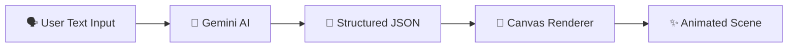
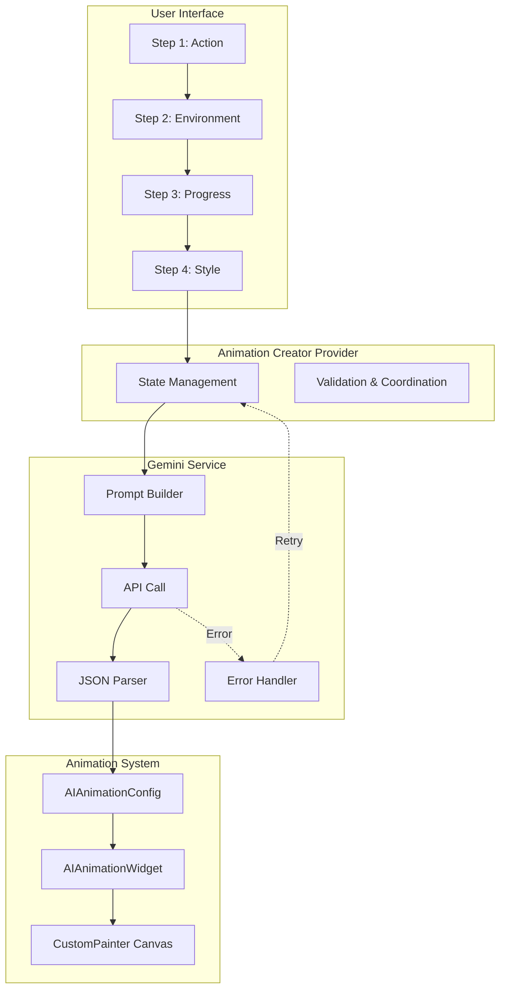
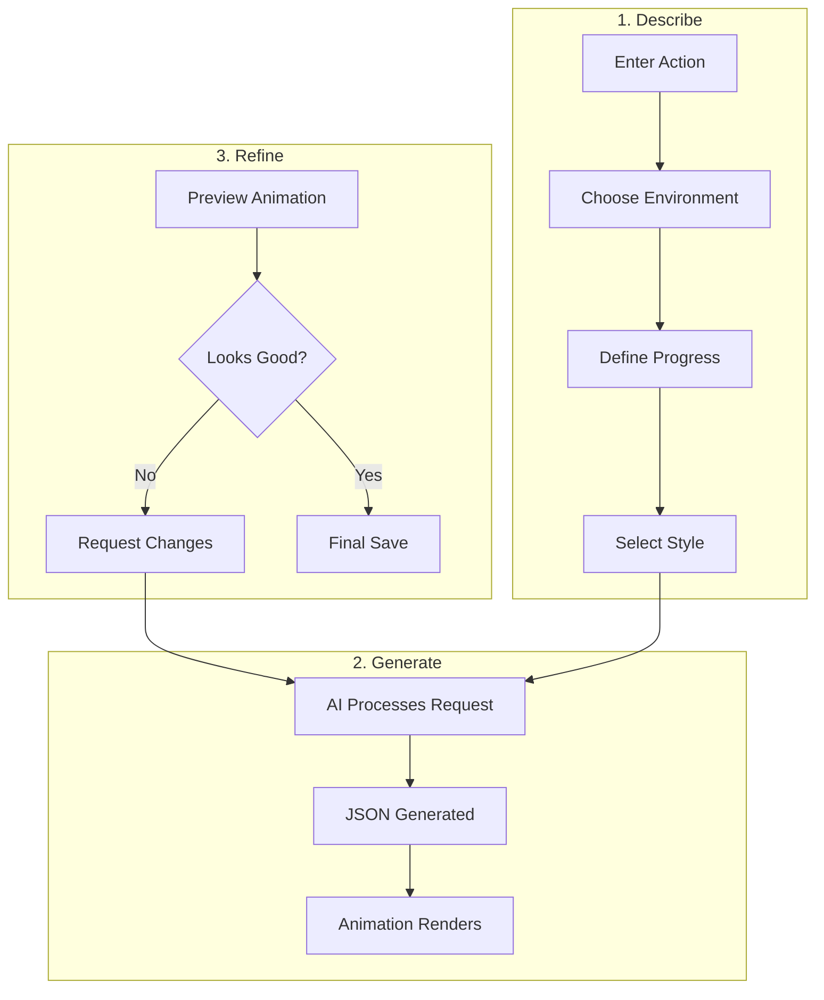
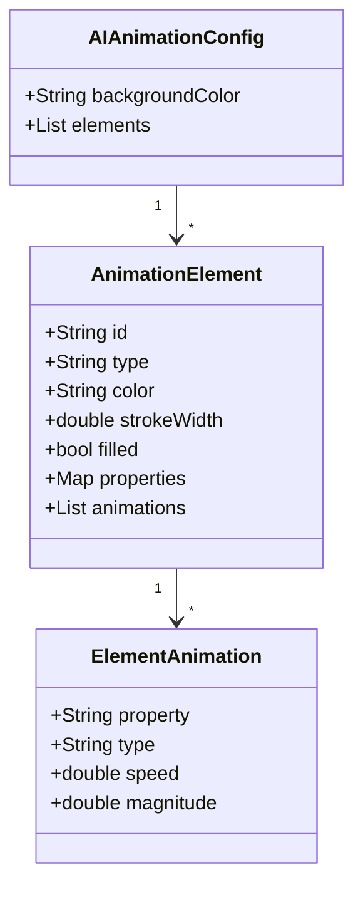
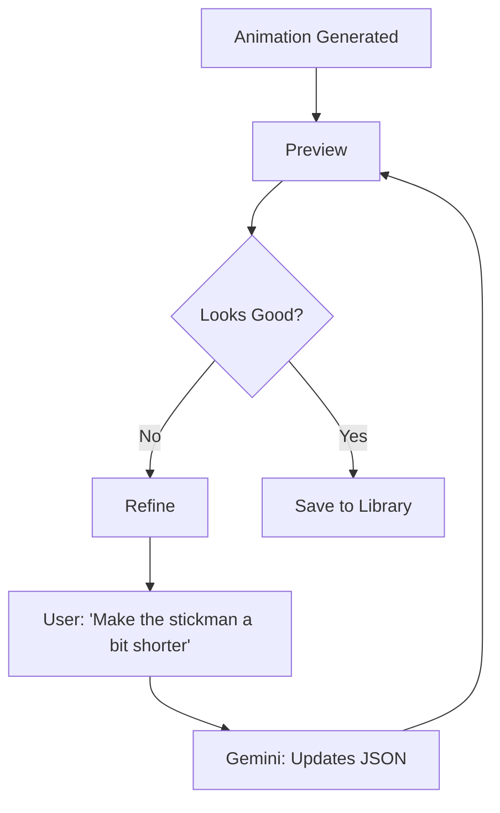
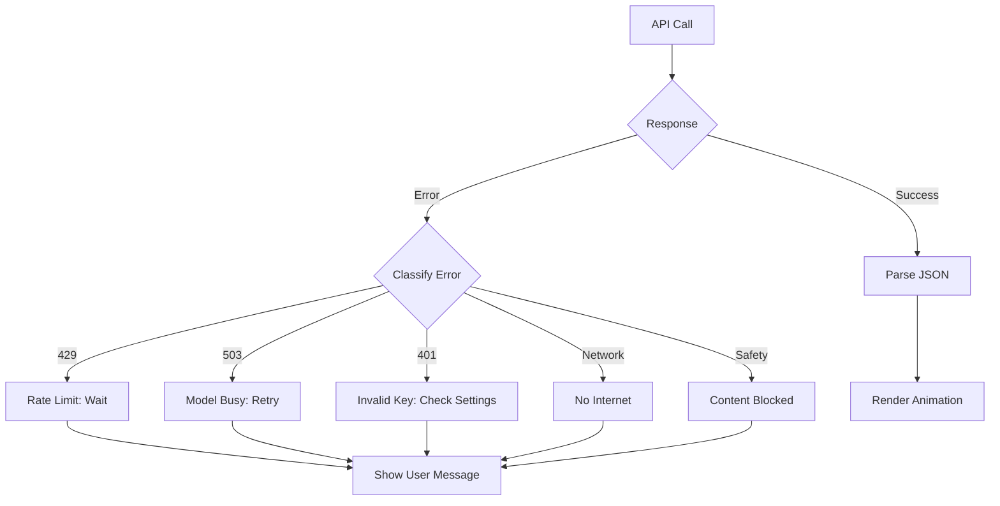
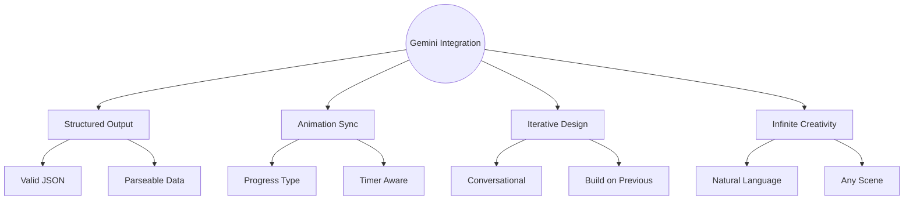

<div align="center">

# 🤖 Gemini AI Integration

### *The AI layer behind the experience*

**How we use Gemini to create living, breathing animations**

</div>

---

## 🎯 Overview

Stickman Productivity uses **Google Gemini AI** to convert plain English descriptions into fully animated stickman vector graphics. This is a **structured data generation** that powers real time animations synchronized with your focus timer.


```mermaid
graph LR
    A["🗣️ User Text Input"] --> B["🤖 Gemini AI"]
    B --> C["📄 Structured JSON"]
    C --> D["🎨 Canvas Renderer"]
    D --> E["✨ Animated Scene"]
```

---

## 🏗️ Architecture


```mermaid
graph TB
    subgraph User [User Interface]
        W1[Step 1: Action]
        W2[Step 2: Environment]
        W3[Step 3: Progress]
        W4[Step 4: Style]
    end
    
    subgraph Provider [Animation Creator Provider]
        ST[State Management]
        VC[Validation & Coordination]
    end
    
    subgraph Gemini [Gemini Service]
        PM[Prompt Builder]
        API[API Call]
        JP[JSON Parser]
        EH[Error Handler]
    end
    
    subgraph Renderer [Animation System]
        CFG[AIAnimationConfig]
        WDG[AIAnimationWidget]
        CVS[CustomPainter Canvas]
    end
    
    W1 --> W2 --> W3 --> W4
    W4 --> ST
    ST --> PM
    PM --> API
    API --> JP
    JP --> CFG
    CFG --> WDG
    WDG --> CVS
    
    API -.->|Error| EH
    EH -.->|Retry| ST
```

---

## 📝 The Wizard Flow

### Step-by-Step User Journey


```mermaid
graph TD
    subgraph Describe [1. Describe]
        A1[Enter Action] --> A2[Choose Environment]
        A2 --> A3[Define Progress]
        A3 --> A4[Select Style]
    end
    
    subgraph Generate [2. Generate]
        B1[AI Processes Request] --> B2[JSON Generated]
        B2 --> B3[Animation Renders]
    end
    
    subgraph Refine [3. Refine]
        C1[Preview Animation] --> C2{Looks Good?}
        C2 -->|No| C3[Request Changes]
        C3 --> B1
        C2 -->|Yes| C4[Final Save]
    end
    
    A4 --> B1
```

| Step | Question | Example Input |
|------|----------|---------------|
| **1. Action** | *What's happening?* | "A stickman aiming shooting an arrow from his archer to the circular aimbox" |
| **2. Environment** | *Where is it?* | "Inside the Room" |
| **3. Progress** | *How does it change?* | "The arrow moves towards the aimbox as time progresses and the finally reaches the center of the aimbox at the end of the timer" |
| **4. Style** | *Visual aesthetic?* | "None" |

---

## 🎯 The Prompts

### Generation Prompt

This is the exact prompt sent to Gemini when creating a new animation:

```
You are a Vector Graphics Generator. Create a JSON description of a scene 
using geometric primitives (circles, lines, rects).

USER REQUEST:
Action: "{action}"
Environment: "{environment}"
Progress/Interaction: "{progress}"
Style: "{style}"

INSTRUCTIONS:
1. Deconstruct the scene into simple shapes (lines for stickfigures, 
   circles for heads/suns, rects for buildings/ground).
2. Coordinates are normalized (0.0 to 1.0). Top-left is (0,0). 
   Bottom-right is (1,1).
3. Ground level is usually around Y=0.8.
4. ANIMATION: Use the "animations" array to make things move.
   - "type": "sine" (for waving/breathing)
   - "type": "linear" (for moving across screen)
   - "type": "progress" (CRITICAL: Use this for long-term changes 
     aligned with the timer)
   - "property": Which value to animate (e.g., "y1", "cx", "rotation", "h")
   - "magnitude": Amount to change. Use NEGATIVE for shrinking.

JSON STRUCTURE (Return ONLY this):
{
  "backgroundColor": "#1E1E1E",
  "elements": [
    {
      "id": "item_1",
      "type": "circle",
      "color": "#FFFFFF",
      "strokeWidth": 2.0,
      "filled": false,
      "properties": {
        "cx": 0.5, "cy": 0.5, "r": 0.1
      },
      "animations": [
        {
          "property": "cx",
          "type": "sine",
          "speed": 1.0,
          "magnitude": 0.1
        }
      ]
    }
  ]
}

Create a COMPLEX and DETAILED scene. Use 10-20 elements if needed.
```

### Refinement Prompt

When users want to modify an existing animation:

```
You are a Vector Graphics Generator. Modify the existing JSON scene 
based on the user's instructions.

CURRENT JSON:
{current animation JSON}

USER INSTRUCTIONS:
"{user's refinement request}"

TASKS:
1. Parse the Current JSON.
2. Apply the requested changes.
3. Keep the rest intact unless asked to change it.
4. If adding new elements, use standard primitives with 
   normalized coordinates (0.0-1.0).

RETURN FORMAT:
Return ONLY the updated JSON structure.
```

---


## 📊 What Gemini Returns in The JSON Format

### In Plain English

When a user says *"A stickman cycling towards the checkpoint*, Gemini doesn't return a picture. It returns a **blueprint**: a structured JSON object that tells our app exactly what to draw and how to animate it. Think of it like an architect's plan: shapes, positions, colors, and movement instructions.

Every response contains:
1. **A background color** for the scene
2. **A list of elements** — each one is a simple shape (a dot, a line, or a rectangle)
3. **Animations attached to elements** — telling each shape how to move over time

### Class Diagram


```mermaid
classDiagram
    class AIAnimationConfig {
        +String backgroundColor
        +List elements
    }
    
    class AnimationElement {
        +String id
        +String type
        +String color
        +double strokeWidth
        +bool filled
        +Map properties
        +List animations
    }
    
    class ElementAnimation {
        +String property
        +String type
        +double speed
        +double magnitude
    }
    
    AIAnimationConfig "1" --> "*" AnimationElement
    AnimationElement "1" --> "*" ElementAnimation
```

### Full Example: What Gemini Actually Returns

Below is a **real JSON response** from Gemini for the prompt *"A stickman watering a plant that grows"*, annotated with explanations:

```json
{
  "backgroundColor": "#1A1A2E",        // Dark blue-black canvas

  "elements": [

    // -------- THE STICKMAN --------

    {
      "id": "head",                    // Unique name for this shape
      "type": "circle",                // It's a circle (the head)
      "color": "#FFFFFF",              // White color
      "strokeWidth": 2.0,             // Line thickness
      "filled": false,                 // Just an outline, not solid
      "properties": {
        "cx": 0.25,                    // Center X at 25% from left
        "cy": 0.55,                    // Center Y at 55% from top
        "r": 0.03                      // Radius = 3% of canvas width
      },
      "animations": [
        {
          "property": "cy",            // Animate the Y position
          "type": "sine",              // Smooth up-and-down bobbing
          "speed": 2.0,                // How fast it bobs
          "magnitude": 0.01            // How far it moves (1% of canvas)
        }
      ]
    },

    {
      "id": "body",
      "type": "line",                  // A straight line (the torso)
      "color": "#FFFFFF",
      "strokeWidth": 2.0,
      "properties": {
        "x1": 0.25, "y1": 0.58,       // Line starts here (neck)
        "x2": 0.25, "y2": 0.72        // Line ends here (waist)
      },
      "animations": []                 // No movement — body stays still
    },

    {
      "id": "right_arm",
      "type": "line",
      "color": "#FFFFFF",
      "strokeWidth": 2.0,
      "properties": {
        "x1": 0.25, "y1": 0.62,       // Shoulder
        "x2": 0.32, "y2": 0.66        // Hand (holding watering can)
      },
      "animations": [
        {
          "property": "y2",            // Move the hand up and down
          "type": "sine",              // Watering motion
          "speed": 1.5,
          "magnitude": 0.02
        }
      ]
    },

    // -------- THE PLANT --------

    {
      "id": "stem",
      "type": "rect",                  // A rectangle (the growing stem)
      "color": "#4CAF50",              // Green
      "strokeWidth": 0,
      "filled": true,                  // Solid fill
      "properties": {
        "x": 0.48,                     // Position X
        "y": 0.80,                     // Starts at ground level
        "w": 0.02,                     // Narrow width
        "h": 0.0                       // Height starts at ZERO
      },
      "animations": [
        {
          "property": "h",             // Animate the HEIGHT
          "type": "progress",          // ⭐ THE KEY: Synced to timer
          "speed": 1.0,
          "magnitude": -0.25           // Grows to 25% of canvas
        }                              // (negative = grows UPWARD)
      ]
    },

    {
      "id": "ground",
      "type": "rect",
      "color": "#3E2723",              // Brown
      "strokeWidth": 0,
      "filled": true,
      "properties": {
        "x": 0.0, "y": 0.80,
        "w": 1.0, "h": 0.20           // Full width ground at bottom
      },
      "animations": []
    }
  ]
}
```

### Field-by-Field Breakdown

#### Top Level

| Field | What It Is | Example |
|-------|-----------|---------|
| `backgroundColor` | The canvas background color (hex) | `"#1A1A2E"` (dark blue) |
| `elements` | Array of every shape in the scene | 5-20 elements per scene |

#### Each Element (Shape)

| Field | What It Is | Why It Matters |
|-------|-----------|----------------|
| `id` | Unique name like `"head"`, `"stem"` | Identifies each shape for refinement |
| `type` | `"circle"`, `"line"`, or `"rect"` | Determines how the shape is drawn |
| `color` | Hex color code | `"#FFFFFF"` = white, `"#4CAF50"` = green |
| `strokeWidth` | Thickness of the outline | `2.0` for stick figures, `0` for filled shapes |
| `filled` | Solid fill or just outline? | `true` = filled, `false` = outline only |
| `properties` | Position and size values | Depends on shape type (see below) |
| `animations` | How this shape moves | Can have zero or multiple animations |

#### Shape Properties (All values 0.0 to 1.0 — normalized to any screen size)

| Shape | Properties | Visual Meaning |
|-------|-----------|----------------|
| **Circle** | `cx`, `cy`, `r` | Center X, Center Y, Radius |
| **Line** | `x1`, `y1`, `x2`, `y2` | Start point → End point |
| **Rect** | `x`, `y`, `w`, `h` | Top-left corner, Width, Height |

> **Why 0.0 to 1.0?** This means `cx: 0.5` = center of screen, regardless of whether it's a small phone or a large tablet. The animation looks the same everywhere.

#### Animation Properties

| Field | What It Controls | Example |
|-------|-----------------|---------|
| `property` | WHICH value to animate | `"cy"` = move vertically, `"h"` = change height |
| `type` | HOW it moves | See animation types below |
| `speed` | How fast | `1.0` = normal, `3.0` = 3x faster |
| `magnitude` | How much | `0.1` = move 10% of canvas, `-0.3` = shrink by 30% |

### Animation Types — The Heart of the System

| Type | In Plain English | Technical Behavior | Example |
|------|------------------|--------------------|---------|
| `sine` | **Smooth back-and-forth** — like breathing or waving | `value = base + sin(time × speed) × magnitude` | A stickman's head bobbing up and down |
| `linear` | **Steady movement** — keeps going in one direction | `value = base + (time × speed) × magnitude` | Clouds drifting across the sky |
| `progress` | **⭐ Timer-synced** — changes proportionally as your session runs | `value = base + timerProgress × magnitude` | A wall growing taller as you focus |
| `pulse` | **Rhythmic scaling** — gets bigger and smaller repeatedly | `value = base + ((sin(time)+1)/2) × magnitude` | A glowing light pulsing |

> **The `progress` type is our core innovation.** It's the bridge between Gemini's output and the timer. When Gemini assigns `"type": "progress"` to a plant's height, that plant isn't just animated randomly — it grows *because you're working*. Timer at 50%? Plant is at 50%. Timer done? Plant is fully grown. This creates a direct emotional link between effort and visual reward.

---

## 🔄 Refinement Loop


```mermaid
graph TD
    A[Animation Generated] --> B[Preview]
    B --> C{Looks Good?}
    C -->|No| D[Refine]
    D --> E[User: 'Make the stickman a bit shorter']
    E --> F[Gemini: Updates JSON]
    F --> B
    C -->|Yes| G[Save to Library]
```

### Example Refinements

| User Says | Gemini Does |
|-----------|-------------|
| *"Make the sun yellow"* | Updates sun element's `color` to `#FFD700` |
| *"Add clouds"* | Inserts new circle elements with offset positions |
| *"Make him walk faster"* | Increases `speed` on leg animation objects |
| *"Remove the tree"* | Deletes tree-related elements from array |

---

## ⚠️ Error Handling


```mermaid
graph TD
    API[API Call] --> R{Response}
    R -->|Success| PARSE[Parse JSON]
    R -->|Error| CLASSIFY{Classify Error}
    
    CLASSIFY -->|429| RATE[Rate Limit: Wait]
    CLASSIFY -->|503| BUSY[Model Busy: Retry]
    CLASSIFY -->|401| KEY[Invalid Key: Check Settings]
    CLASSIFY -->|Network| NET[No Internet]
    CLASSIFY -->|Safety| SAFE[Content Blocked]
    
    RATE --> MSG[Show User Message]
    BUSY --> MSG
    KEY --> MSG
    NET --> MSG
    SAFE --> MSG
    
    PARSE --> RENDER[Render Animation]
```

---

## ⚙️ Model Configuration

### Supported Models

| Model |
|-------|
| `gemini-3-pro-preview` |
| `gemini-3-flash-preview` |
| `gemini-flash-latest` |
| `gemini-flash-lite-latest` |
``


### Setup

1. Get API key → [Google AI Studio](https://aistudio.google.com/)
2. App Settings → Enter key
3. Select model from dropdown

---

## 🏆 Why This Is Innovative


```mermaid
graph TD
    Root((Gemini Integration)) --> A[Structured Output]
    Root --> B[Animation Sync]
    Root --> C[Iterative Design]
    Root --> D[Infinite Creativity]
    
    A --> A1[Valid JSON]
    A --> A2[Parseable Data]
    
    B --> B1[Progress Type]
    B --> B2[Timer Aware]
    
    C --> C1[Conversational]
    C --> C2[Build on Previous]
    
    D --> D1[Natural Language]
    D --> D2[Any Scene]
```

---

<div align="center">

**[← Back to README](./README.md) • [Animation System →](./ANIMATION_SYSTEM.md)**

</div>
