<div align="center">

# 🤖 Gemini AI Integration

### *The Brain Behind the Magic*

**How we transform natural language into living, breathing animations**

</div>

---

## 🎯 Overview

Stickman Productivity uses **Google Gemini AI** to convert plain English descriptions into fully animated vector graphics. This isn't image generation—it's **structured data generation** that powers real-time animations synchronized with your focus timer.

```mermaid
graph LR
    A["🗣️ Natural Language"] --> B["🤖 Gemini AI"]
    B --> C["📄 Structured JSON"]
    C --> D["🎨 Canvas Renderer"]
    D --> E["✨ Animated Scene"]
```



---

## 🏗️ Architecture


---

## 📝 The Wizard Flow

### Step-by-Step User Journey


| Step | Question | Example Input |
|------|----------|---------------|
| **1. Action** | *What's happening?* | "A stickman painting on a canvas" |
| **2. Environment** | *Where is it?* | "Art studio with easel" |
| **3. Progress** | *How does it change?* | "Painting gets more complete as timer runs" |
| **4. Style** | *Visual aesthetic?* | "Minimalist, warm colors, playful" |

---

## 🎯 The Prompts

### Generation Prompt

This is the exact prompt sent to Gemini when creating a new animation:

```
You are a Vector Graphics Generator. Create a JSON description of a scene 
using geometric primitives (circles, lines, rects).

USER REQUEST:
Action: "{action}"
Environment: "{environment}"
Progress/Interaction: "{progress}"
Style: "{style}"

INSTRUCTIONS:
1. Deconstruct the scene into simple shapes (lines for stickfigures, 
   circles for heads/suns, rects for buildings/ground).
2. Coordinates are normalized (0.0 to 1.0). Top-left is (0,0). 
   Bottom-right is (1,1).
3. Ground level is usually around Y=0.8.
4. ANIMATION: Use the "animations" array to make things move.
   - "type": "sine" (for waving/breathing)
   - "type": "linear" (for moving across screen)
   - "type": "progress" (CRITICAL: Use this for long-term changes 
     aligned with the timer)
   - "property": Which value to animate (e.g., "y1", "cx", "rotation", "h")
   - "magnitude": Amount to change. Use NEGATIVE for shrinking.

JSON STRUCTURE (Return ONLY this):
{
  "backgroundColor": "#1E1E1E",
  "elements": [
    {
      "id": "item_1",
      "type": "circle",
      "color": "#FFFFFF",
      "strokeWidth": 2.0,
      "filled": false,
      "properties": {
        "cx": 0.5, "cy": 0.5, "r": 0.1
      },
      "animations": [
        {
          "property": "cx",
          "type": "sine",
          "speed": 1.0,
          "magnitude": 0.1
        }
      ]
    }
  ]
}

Create a COMPLEX and DETAILED scene. Use 10-20 elements if needed.
```

### Refinement Prompt

When users want to modify an existing animation:

```
You are a Vector Graphics Generator. Modify the existing JSON scene 
based on the user's instructions.

CURRENT JSON:
{current animation JSON}

USER INSTRUCTIONS:
"{user's refinement request}"

TASKS:
1. Parse the Current JSON.
2. Apply the requested changes.
3. Keep the rest intact unless asked to change it.
4. If adding new elements, use standard primitives with 
   normalized coordinates (0.0-1.0).

RETURN FORMAT:
Return ONLY the updated JSON structure.
```

---

## 📊 JSON Schema


### Animation Types

| Type | Behavior | Use Case |
|------|----------|----------|
| `sine` | Smooth oscillation | Breathing, waving, bobbing |
| `linear` | Constant movement | Walking, scrolling |
| `progress` | **Synced to timer 0→1** | Growing, building, filling |
| `pulse` | Rhythmic scaling | Heartbeat, emphasis |

---

## 🔄 Refinement Loop


### Example Refinements

| User Says | Gemini Does |
|-----------|-------------|
| *"Make the sun yellow"* | Updates sun element's `color` to `#FFD700` |
| *"Add clouds"* | Inserts new circle elements with offset positions |
| *"Make him walk faster"* | Increases `speed` on leg animation objects |
| *"Remove the tree"* | Deletes tree-related elements from array |

---

## ⚠️ Error Handling


---

## ⚙️ Model Configuration

### Supported Models

| Model | Speed | Quality | Best For |
|-------|-------|---------|----------|
| `gemini-2.0-flash` | ⚡⚡⚡ | ★★★★ | Default choice |
| `gemini-2.0-flash-lite` | ⚡⚡⚡⚡ | ★★★ | Quick iterations |
| `gemini-1.5-pro` | ⚡⚡ | ★★★★★ | Complex scenes |
| `gemini-1.5-flash` | ⚡⚡⚡ | ★★★★ | Balanced |

### Setup

1. Get API key → [Google AI Studio](https://aistudio.google.com/)
2. App Settings → Enter key
3. Select model from dropdown

---

## 🏆 Why This Is Innovative


---

<div align="center">

**[← Back to README](./README.md) • [Animation System →](./ANIMATION_SYSTEM.md)**

</div>
