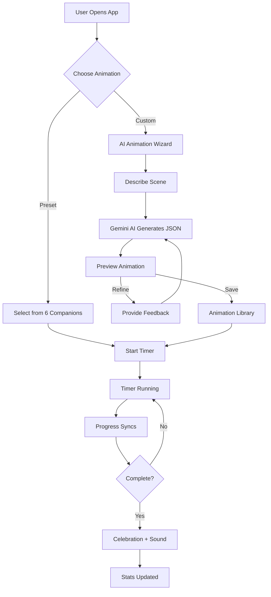
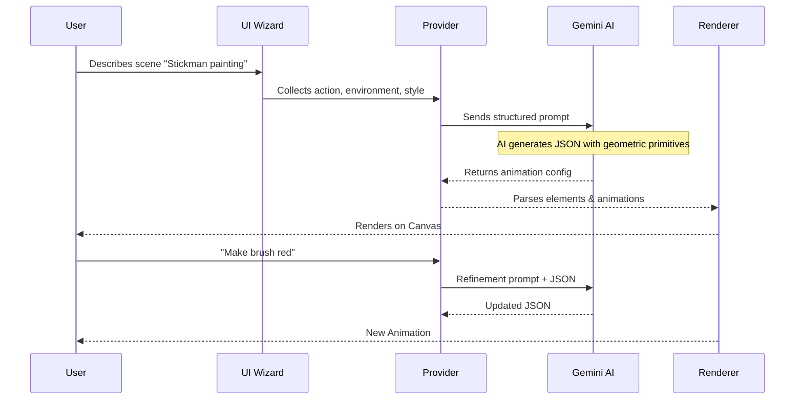

<div align="center">

# 🎯 Stickman Focus

### *Where Productivity is felt than counted*

**An AI-powered productivity timer with animated companions that bring your focus sessions to life**

[](https://flutter.dev)
[](https://deepmind.google/technologies/gemini/)
[](LICENSE)

---

## 📥 Download

[](https://github.com/muhammedashharps/stickman/raw/main/stickman-productivity.apk)

**[Click here to download the app directly!](https://github.com/muhammedashharps/stickman/raw/main/stickman-productivity.apk)**

---

**[Features](#-features) • [How It Works](#-how-it-works) • [AI Magic](#-ai-magic) • [Installation](#-installation) • [Documentation](#-documentation)**

</div>

---

## 📱 App Screenshots

<div align="center">

| | | |
|:---:|:---:|:---:|
|  |  |  |
|  |  |  |

</div>

---

## 🌟 The Problem We Solve

Traditional timers are **boring**. You stare at numbers counting down. There's no emotional connection, no visual reward for your effort.

**Stickman Productivity transforms this experience.** 

Watch a tiny stickman build a bridge as you work. See a plant grow with each passing minute. Or describe ANY scene you can imagine—and watch our **Gemini AI** bring it to life, synchronized perfectly with your timer.

---

## ✨ Features

<table>
<tr>
<td width="50%">

### 🤖 Gemini Animation Creator
**The core of this app** — powered by Google Gemini AI:
- Type what you imagine → Gemini generates animated vector graphics
- Transforms text into geometric primitives using normalized coordinates
- **Every animation syncs live with your focus timer progress**
- Refine your creation through conversational feedback
- Unlimited custom animations saved locally

</td>
<td width="50%">

### 🎬 6 Preset Animations
Hand-crafted stickman companions:
- 🌱 **Plant Growth**
- ⛰️ **Mountain Climb**
- 💡 **Bulb Ladder**
- 🌉 **Bridge Builder**
- 🧗 **Cliff Climb**
- 💧 **Water Tank**

</td>
</tr>
<tr>
<td colspan="2">

### 📊 Rich Statistics  
- Daily/Weekly/Monthly/Yearly views
- Interactive calendar heatmap
- Session history with details
- Streak tracking

</td>
</tr>
</table>

---

## 🔄 How It Works



---

## 🧠 AI Magic

### The Gemini Integration Flow



### What Makes It Special

| Traditional Apps | Stickman Productivity |
|-----------------|----------------------|
| Static timers | **Living animations** |
| Fixed visuals | **Infinite AI-generated scenes** |
| No progression | **Timer-synced visual progress** |
| Boring numbers | **Story-driven focus sessions** |

---

## 🛠️ Installation

```bash
# Clone
git clone https://github.com/muhammedashharps/stickman.git
cd stickman

# Install dependencies
flutter pub get

# Run
flutter run
```

### Configure Gemini AI
1. Get API key from [Google AI Studio](https://aistudio.google.com/)
2. Open app → ⚙️ Settings
3. Enter API key & select model

---

## 📚 Documentation

| Document | Description |
|----------|-------------|
| [**GEMINI_INTEGRATION.md**](./GEMINI_INTEGRATION.md) | Full AI workflow, prompts, JSON schema |
| [**ANIMATION_SYSTEM.md**](./ANIMATION_SYSTEM.md) | Rendering pipeline, timer sync, element types |

---

<div align="center">

### Made with ❤️ and Gemini AI

</div>
