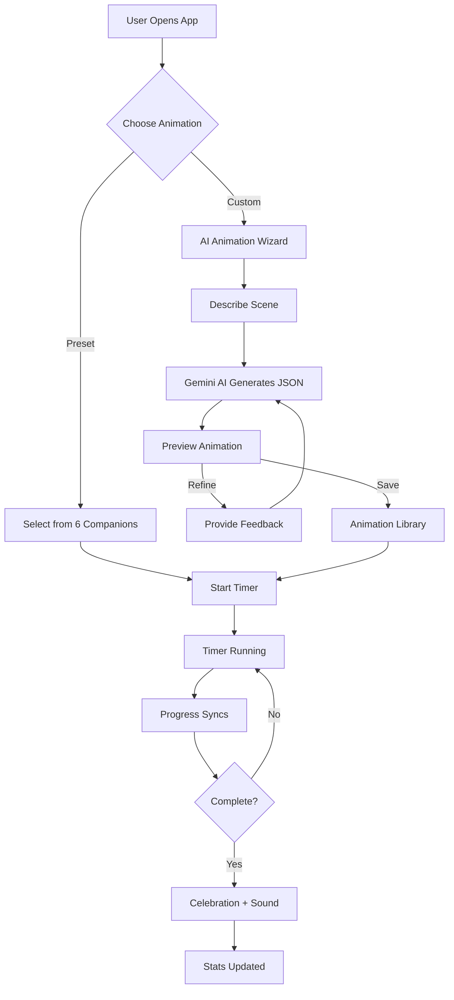
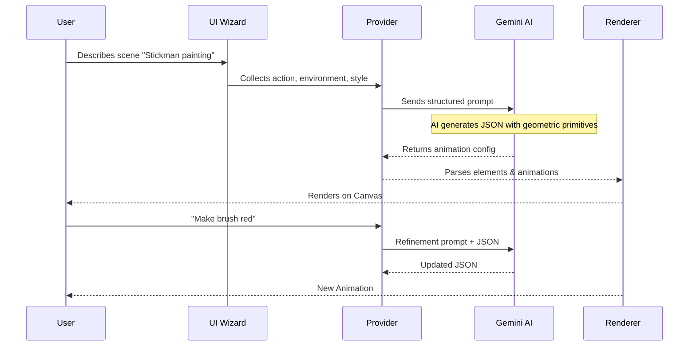
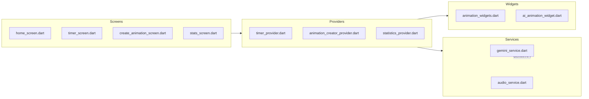

<div align="center">

# 🎯 Stickman Productivity

### *Where Focus Meets Art*

**An AI-powered productivity timer with animated companions that bring your focus sessions to life**

[](https://flutter.dev)
[](https://deepmind.google/technologies/gemini/)
[](LICENSE)

---

**[Features](#-features) • [How It Works](#-how-it-works) • [AI Magic](#-ai-magic) • [Installation](#-installation) • [Documentation](#-documentation)**

</div>

---

## 🌟 The Problem We Solve

Traditional timers are **boring**. You stare at numbers counting down. There's no emotional connection, no visual reward for your effort.

**Stickman Productivity transforms this experience.** 

Watch a tiny stickman build a bridge as you work. See a plant grow with each passing minute. Or describe ANY scene you can imagine—and watch our **Gemini AI** bring it to life, synchronized perfectly with your timer.

---

## ✨ Features

<table>
<tr>
<td width="50%">

### 🎬 6 Preset Animations
Hand-crafted, physics-based stickman companions:
- 🌱 **Plant Growth** — Nurture a garden
- ⛰️ **Mountain Climb** — Conquer the summit  
- 💡 **Bulb Ladder** — Light up ideas
- 🌉 **Bridge Builder** — Connect worlds
- 🧗 **Cliff Climb** — Scale new heights
- 💧 **Water Tank** — Fill with patience

</td>
<td width="50%">

### 🤖 AI Animation Creator
Powered by **Google Gemini**:
- Describe any scene in natural language
- AI generates animated vector graphics
- Iterate and refine through conversation
- Save unlimited custom animations

</td>
</tr>
<tr>
<td>

### ⏱️ Smart Timer
- Wheel-style duration picker
- 1-180 minute range
- **Background persistence** — continues when minimized
- Completion sounds

</td>
<td>

### 📊 Rich Statistics  
- Daily/Weekly/Monthly/Yearly views
- Interactive calendar heatmap
- Session history with details
- Streak tracking

</td>
</tr>
</table>

---

## 🔄 How It Works



---

## 🧠 AI Magic

### The Gemini Integration Flow



### What Makes It Special

| Traditional Apps | Stickman Productivity |
|-----------------|----------------------|
| Static timers | **Living animations** |
| Fixed visuals | **Infinite AI-generated scenes** |
| No progression | **Timer-synced visual progress** |
| Boring numbers | **Story-driven focus sessions** |

---

## 🛠️ Installation

```bash
# Clone
git clone https://github.com/yourusername/stickman_productivity.git
cd stickman_productivity

# Install dependencies
flutter pub get

# Run
flutter run
```

### Configure Gemini AI
1. Get API key from [Google AI Studio](https://aistudio.google.com/)
2. Open app → ⚙️ Settings
3. Enter API key & select model

---

## 📁 Project Structure



---

## 📚 Documentation

| Document | Description |
|----------|-------------|
| [**GEMINI_INTEGRATION.md**](./GEMINI_INTEGRATION.md) | Full AI workflow, prompts, JSON schema |
| [**ANIMATION_SYSTEM.md**](./ANIMATION_SYSTEM.md) | Rendering pipeline, timer sync, element types |

---

## 🏆 Hackathon Submission

> **Built for the Gemini AI Hackathon**

### Innovation Highlights

1. **Text → Animated Graphics**: Gemini generates structured JSON, not just text/images
2. **Timer-Synced Animations**: The `progress` animation type creates live session feedback
3. **Iterative Refinement**: Users improve animations conversationally
4. **Infinite Creativity**: Any scene imaginable becomes a focus companion

---

<div align="center">

### Made with ❤️ and Gemini AI

**[⬆ Back to Top](#-stickman-productivity)**

</div>
